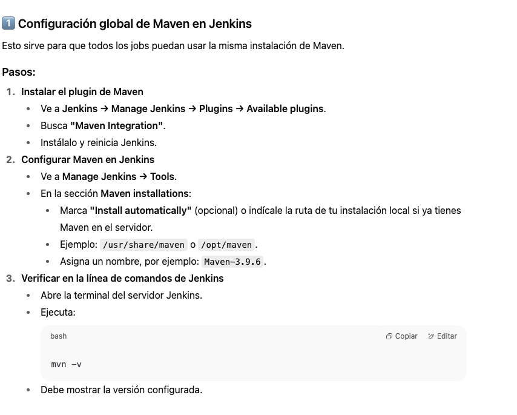

# ms-wh-example-batch

This project uses Quarkus, the Supersonic Subatomic Java Framework.

If you want to learn more about Quarkus, please visit its website: <https://quarkus.io/>.

## Running the application in dev mode

You can run your application in dev mode that enables live coding using:

```shell script
./mvnw quarkus:dev
```

> **_NOTE:_**  Quarkus now ships with a Dev UI, which is available in dev mode only at <http://localhost:8080/q/dev/>.

## Packaging and running the application

The application can be packaged using:

```shell script
./mvnw package
```

It produces the `quarkus-run.jar` file in the `target/quarkus-app/` directory.
Be aware that it’s not an _über-jar_ as the dependencies are copied into the `target/quarkus-app/lib/` directory.

The application is now runnable using `java -jar target/quarkus-app/quarkus-run.jar`.

If you want to build an _über-jar_, execute the following command:

```shell script
./mvnw package -Dquarkus.package.jar.type=uber-jar
```

The application, packaged as an _über-jar_, is now runnable using `java -jar target/*-runner.jar`.

## Creating a native executable

You can create a native executable using:

```shell script
./mvnw package -Dnative
```

Or, if you don't have GraalVM installed, you can run the native executable build in a container using:

```shell script
./mvnw package -Dnative -Dquarkus.native.container-build=true
```

You can then execute your native executable with: `./target/ms-wh-example-batch-1.0.0-SNAPSHOT-runner`

If you want to learn more about building native executables, please consult <https://quarkus.io/guides/maven-tooling>.

## Related Guides

- Messaging - Kafka Connector ([guide](https://quarkus.io/guides/kafka-getting-started)): Connect to Kafka with Reactive Messaging


## CONFIGURACION DE JEKINS


✅ 1. Crear un Personal Access Token (PAT) en GitHub
🔹 Pasos:
Ve a https://github.com/settings/tokens

Click en "Generate new token" → Fine-grained o Classic (se recomienda Classic para Jenkins)

Selecciona:

Repo (leer/clonar repositorios)

Workflow (opcional si usas GitHub Actions)

Elige la expiración (o sin expiración si es de confianza)

Guarda el token que se genera → ¡No se puede recuperar luego!


✅ 2. Agregar el token de GitHub en Jenkins como credencial
🔹 Pasos:
En Jenkins, ve a:
Manage Jenkins → Credentials → (Global) → Add Credentials

Tipo: Secret text

Pega el token de GitHub como valor

ID: github-token (o cualquier nombre que recuerdes)

Description: GitHub Personal Token


